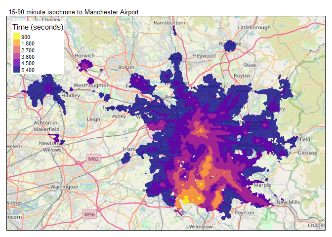

<!-- README.md is generated from README.Rmd. Please edit that file -->

otpr 
==================================================================

<!-- badges: start -->

[](https://travis-ci.org/marcusyoung/otpr)
[](https://cran.r-project.org/package=otpr)
[](https://codecov.io/gh/marcusyoung/otpr?branch=master)
[](https://cran.r-project.org/package=otpr)
[](https://www.repostatus.org/#active)
<!-- badges: end -->

Overview
--------

**otpr** is an R package that provides a simple wrapper for the
[OpenTripPlanner](https://www.opentripplanner.org/) (OTP) API. To use
**otpr** you will need a running instance of OTP. The purpose of the
package is to submit a query to the relevant OTP API resource, parse the
OTP response and return useful R objects.

This package will be useful to researchers and transport planners who
want to use OTP to generate trip data for accessibility analysis or to
derive variables for use in transportation models.

Version support
---------------

**otpr** supports OTP versions 1 and 2. However, as OTPv2 has not yet
been released and changes to its codebase could cause errors in otpr or
unexpected behaviour, OTPv2 support is currently considered
experimental. Known issues with OTPv2 include:

-   `otp_get_isochrone()` is only supported in OTPv1 as this feature has
    been removed from OTPv2.
-   The maxWalkDistance parameter used in the `otp_get_times()` function
    is treated as a hard limit when the mode is either WALK or BICYCLE.
    This could result in no itinerary being returned as the default is
    800m. This is different from the behaviour of OTPv1 where this
    parameter is effectively ignored when the mode is WALK and not
    applied at all to BICYCLE trips. Workaround: provide a large value
    to this parameter for these modes.
-   The ‘routeType’ and ‘agencyUrl’ columns do not appear in the data
    frame of journey legs as these are not returned by OTPv2.

Installation
------------

``` r
# Install from CRAN
install.packages("otpr")
```

### Development version

To get a bug fix, or use a feature from the development version, you can
install otpr from GitHub. See
[NEWS](https://github.com/marcusyoung/otpr/blob/master/NEWS.md) for
changes since last release.

``` r
install.packages("devtools")
devtools::install_github("marcusyoung/otpr")
```

Getting started
---------------

``` r
library(otpr)
```

### Defining an OTP connection

The first step is to call `otp_connect()`, which defines the parameters
needed to connect to a router on a running OTP instance. The function
can also confirm that the router is reachable.

``` r
# For a basic instance of OTP running on localhost with standard ports and a 'default' router
# this is all that's needed
otpcon <- otp_connect()
#> http://localhost:8080/otp is running OTPv1
#> Router http://localhost:8080/otp/routers/default exists
```

#### Handling Time Zones

If the time zone of an OTP graph *differs* from the time zone of the
local system running **otpr** then by default returned trip start and
end times will be expressed in the local system’s time zone and not the
time zone of the graph. This is because the OTP API returns EPOCH values
and the conversion to date and time format occurs on the local system. A
‘timeZone’ column is included in returned dataframes that contain start
and end times to make this explicit. If you wish to have start and end
times expressed in the time zone of the graph, the ‘tz’ argument can be
specified when calling the `otp_connect()` function. This must be a
valid time zone (checked against the vector returned by `OlsonNames()`);
for example: “Europe/Berlin”.

Querying the OTP API
--------------------

### Function behaviour

The functions that query the OTP API generally return a list of three
elements. The first element is an errorId - with the value “OK” or the
error code returned by OTP. If errorId is “OK”, the second element will
contain the query response; otherwise it will contain the OTP error
message, the third element is the query URL that was sent to the OTP API
(for information and useful for troubleshooting).

### Distance between two points

To get the trip distance in metres between an origin and destination on
the street and/or path network use `otp_get_distance()`. You can specify
the required mode: CAR (default), BICYCLE or WALK are valid.

``` r
# Distance between Manchester city centre and Manchester airport by CAR
otp_get_distance(
  otpcon,
  fromPlace = c(53.48805,-2.24258),
  toPlace = c(53.36484,-2.27108)
)
#> $errorId
#> [1] "OK"
#> 
#> $distance
#> [1] 29051.51
#> 
#> $query
#> [1] "http://localhost:8080/otp/routers/default/plan?fromPlace=53.48805,-2.24258&toPlace=53.36484,-2.27108&mode=CAR"

# Now for BICYCLE
otp_get_distance(
  otpcon,
  fromPlace = c(53.48805,-2.24258),
  toPlace = c(53.36484,-2.27108),
  mode = "BICYCLE"
)
#> $errorId
#> [1] "OK"
#> 
#> $distance
#> [1] 16065.04
#> 
#> $query
#> [1] "http://localhost:8080/otp/routers/default/plan?fromPlace=53.48805,-2.24258&toPlace=53.36484,-2.27108&mode=BICYCLE"
```

### Time between two points

To get the trip duration in minutes between an origin and destination
use `otp_get_times()`. You can specify the required mode: TRANSIT (all
available transit modes), BUS, RAIL, CAR, BICYCLE, and WALK are valid.
All the public transit modes automatically allow WALK. There is also the
option to combine TRANSIT with BICYCLE.

``` r
# Time between Manchester city centre and Manchester airport by BICYCLE
otp_get_times(
  otpcon,
  fromPlace = c(53.48805,-2.24258),
  toPlace = c(53.36484,-2.27108),
  mode = "BICYCLE"
)
#> $errorId
#> [1] "OK"
#> 
#> $duration
#> [1] 60.12
#> 
#> $query
#> [1] "http://localhost:8080/otp/routers/default/plan?fromPlace=53.48805,-2.24258&toPlace=53.36484,-2.27108&mode=BICYCLE&date=10-01-2020&time=17:18:09&maxWalkDistance=800&walkReluctance=2&arriveBy=FALSE&transferPenalty=0&minTransferTime=0"


# By default the date and time of travel is taken as the current system date and
# time. This can be changed using the 'date' and 'time' arguments
otp_get_times(
  otpcon,
  fromPlace = c(53.48805,-2.24258),
  toPlace = c(53.36484,-2.27108),
  mode = "TRANSIT",
  date = "04-29-2020",
  time = "07:15:00"
)
#> $errorId
#> [1] "OK"
#> 
#> $duration
#> [1] 42.2
#> 
#> $query
#> [1] "http://localhost:8080/otp/routers/default/plan?fromPlace=53.48805,-2.24258&toPlace=53.36484,-2.27108&mode=TRANSIT,WALK&date=04-29-2020&time=07:15:00&maxWalkDistance=800&walkReluctance=2&arriveBy=FALSE&transferPenalty=0&minTransferTime=0"
```

### Breakdown of time by mode, waiting time and transfers

To get more information about the trip when using transit modes,
`otp_get_times()` can be called with the ‘detail’ argument set to TRUE.
The trip duration (minutes) is then further broken down by time on
transit, walking time (from/to and between stops), waiting time (when
changing transit vehicle or mode), and number of transfers (when
changing transit vehicle or mode).

``` r
# Time between Manchester city centre and Manchester airport by TRANSIT with detail
otp_get_times(
  otpcon,
  fromPlace = c(53.48805,-2.24258),
  toPlace = c(53.36484,-2.27108),
  mode = "TRANSIT",
  date = "04-29-2020",
  time = "07:15:00",
  detail = TRUE
)
#> $errorId
#> [1] "OK"
#> 
#> $itineraries
#>                 start                 end      timeZone duration walkTime
#> 1 2020-04-29 07:37:31 2020-04-29 08:19:43 Europe/London     42.2     5.17
#>   transitTime waitingTime transfers
#> 1          37        0.03         0
#> 
#> $query
#> [1] "http://localhost:8080/otp/routers/default/plan?fromPlace=53.48805,-2.24258&toPlace=53.36484,-2.27108&mode=TRANSIT,WALK&date=04-29-2020&time=07:15:00&maxWalkDistance=800&walkReluctance=2&arriveBy=FALSE&transferPenalty=0&minTransferTime=0"
```

#### Details of each leg for transit-based trips

To get information about each leg of transit-based trips,
`otp_get_times()` can be called with both the ‘detail’ and ‘includeLegs’
arguments set to TRUE. A third element, called ‘legs’, will then be
returned. The ‘legs’ element is a dataframe containing a row for each
leg of the trip. The information provided for each leg includes start
and end times, duration, distance, mode, route details, agency details,
and stop names. There is also a column called ‘departureWait’ which is
the length of time in minutes required to wait before the start of a
leg. The sum of ‘departureWait’ will equal the total waiting time for
the itinerary.

``` r
# Time between Manchester city centre and Manchester airport by TRANSIT with detail and legs
trip <- otp_get_times(
  otpcon,
  fromPlace = c(53.48805,-2.24258),
  toPlace = c(53.36484,-2.27108),
  mode = "TRANSIT",
  date = "04-29-2020",
  time = "07:15:00",
  detail = TRUE,
  includeLegs = TRUE
)

# View legs (first 9 columns)
trip$legs[1:9]
#>             startTime             endTime  distance mode duration
#> 1 2020-04-29 07:37:31 2020-04-29 07:38:59    98.057 WALK     1.47
#> 2 2020-04-29 07:39:00 2020-04-29 08:16:00 17872.820 RAIL    37.00
#> 3 2020-04-29 08:16:01 2020-04-29 08:19:43   245.949 WALK     3.70
#>                   agencyName                    agencyUrl routeType routeId
#> 1                       <NA>                         <NA>        NA    <NA>
#> 2 First TransPennine Express https://www.tpexpress.co.uk/         2 1:13081
#> 3                       <NA>                         <NA>        NA    <NA>
```

### Travel time isochrones

The `otp_get_isochrone()` function can be used to get one or more travel
time isochrones in either GeoJSON or SF format. These are only available
for transit or walking modes (OTP limitation). They can be generated
either *from* (default) or *to* the specified location.

#### GeoJSON example

``` r
# 900, 1800 and 2700 second isochrones for travel *to* Manchester Airport by any transit mode
my_isochrone <- otp_get_isochrone(
  otpcon,
  location = c(53.36484, -2.27108),
  fromLocation = FALSE,
  cutoffs = c(900, 1800, 2700),
  mode = "TRANSIT",
  date = "04-29-2020",
  time = "07:15:00"
)

# function returns a list of two elements
names(my_isochrone)
#> [1] "errorId"  "response" "query"

# now write the GeoJSON (in the "response" element) to a file so it can be opened in QGIS (for example)
write(my_isochrone$response, file = "my_isochrone.geojson")
```

#### SF example

``` r
# request format as "SF"
my_isochrone <- otp_get_isochrone(
  otpcon,
  location = c(53.36484, -2.27108),
  format = "SF",
  fromLocation = FALSE,
  cutoffs = c(900, 1800, 2700, 3600, 4500, 5400),
  mode = "TRANSIT",
  date = "04-29-2020",
  time= "07:15:00",
  maxWalkDistance = 1600,
  walkReluctance = 5,
  minTransferTime = 600
)

# plot using tmap package

library(tmap)
library(tmaptools)

# set bounding box
bbox <- bb(my_isochrone$response)
# get OSM tiles
osm_man <- read_osm(bbox, ext = 1.1)
# plot isochrones
tm_shape(osm_man) +
  tm_rgb() +
  tm_shape(my_isochrone$response) +
  tm_fill(
    col = "time",
    alpha = 0.8,
    palette = "-plasma",
    n = 6,
    style = "cat",
    title = "Time (seconds)"
  ) + tm_layout(legend.position = c("left", "top"), legend.bg.color = "white", 
                main.title = "15-90 minute isochrone to Manchester Airport", 
                main.title.size = 0.8)
```



Learning more
-------------

The example function calls shown above can be extended by passing
additional parameters to the OTP API. Further information is available
in the documentation for each function:

``` r
# get help on using the otp_get_times() function
?otp_get_times
```

If you are new to OTP, then the best place to start is to work through
the tutorial, [OpenTripPlanner Tutorial - creating and querying your own
multi-modal route planner](https://github.com/marcusyoung/otp-tutorial).
This includes everything you need, including example data. The tutorial
also has examples of using **otpr** functions, and helps you get the
most from the package, for example using it to populate an
origin-destination matrix.

If you are already experienced with OTPv1 and want to try v2, you will
need to build it from source. See this
[guide](http://docs.opentripplanner.org/en/dev-2.x/Developers-Guide/)
and this [basic
tutorial](http://docs.opentripplanner.org/en/dev-2.x/Basic-Tutorial/#get-otp)
from the OTP project team.

For more guidance on how **otpr**, in conjunction with OTP, can be used
to generate data for input into models, read [An automated framework to
derive model variables from open transport data using R, PostgreSQL and
OpenTripPlanner](https://eprints.soton.ac.uk/389728/).

Getting help
------------

-   Please [report any issues or
    bugs](https://github.com/marcusyoung/otpr/issues).
-   Get citation information for **otpr** using:
    `citation(package = 'otpr')`.

Want to say thanks?
-------------------

<a href="https://ko-fi.com/marcusyoung"></a>

</br>
